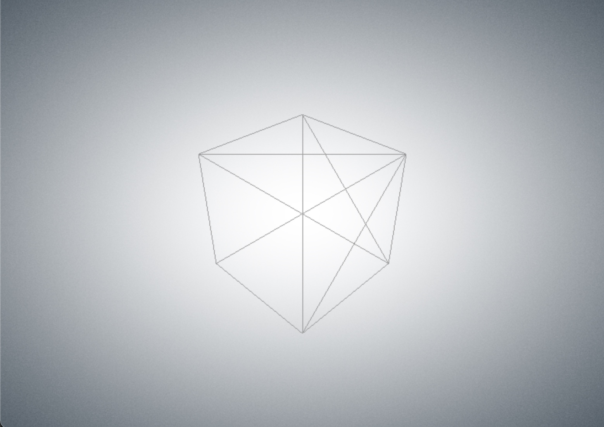

# three-vignette-background

Create a noise background to the threejs scene.

The project fork from: https://github.com/mattdesl/three-vignette-background

I modified it to:
1. support webpack 5. No need to use `glslify`;
2. pack it as a module that can be imported using webpack



---
## 1. Install

    npm install

## 2. Build the library

    npm run build

## 3. Start demo 

    npm start

## Usage
Read the source code of demo.js 
```js
  import { createBackground } from './dist/noise-background'
  const background = createBackground({ grainScale: 0.0015 })
  scene.add(background)
```
[Read here](https://github.com/mattdesl/three-vignette-background#background--createbackgroundopt)
for the detail configs.

## NPM install
  npm i three-vignette-background-esm

  import { createBackground } from 'three-vignette-background-esm/dist/noise-background'

